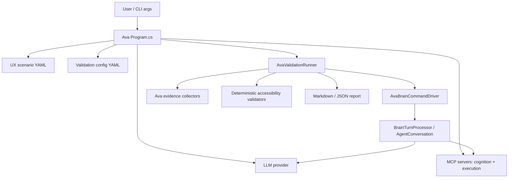
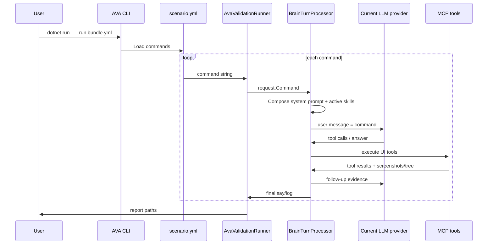
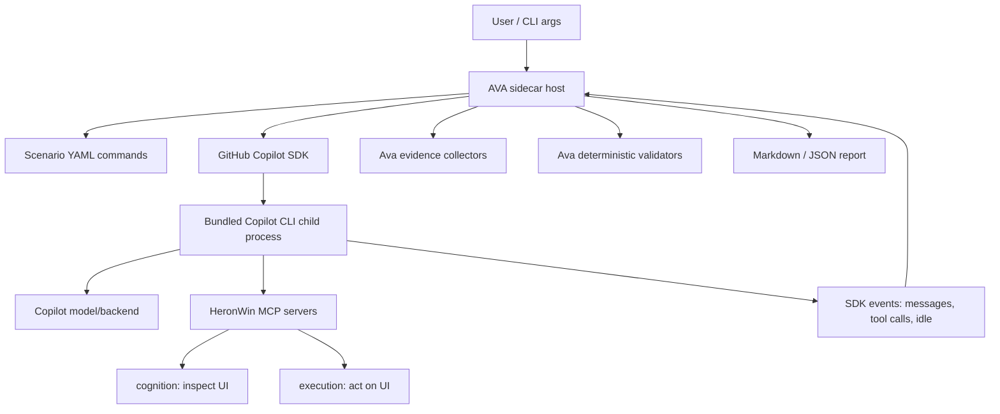
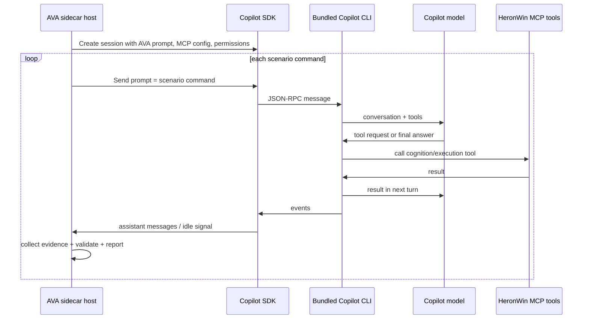

# GitHub Copilot SDK Investigation And Proposal

Research date: 2026-06-27

Status: proposal only. No runtime code has been changed.

## Scope

This investigation focuses on the official GitHub Copilot SDK documented by GitHub and implemented in `github/copilot-sdk`. That SDK embeds Copilot agentic workflows into applications across TypeScript, Python, Go, .NET, Java, and Rust. It is different from the older Copilot Extensions preview SDK, which is for building Copilot Chat extensions.

Because HeronWin is a `.NET` Windows-local assistant workspace, the proposal below is biased toward the official `.NET` package, `GitHub.Copilot.SDK`, and the SDK's local/bundled CLI mode.

## Current HeronWin Fit

Relevant existing HeronWin architecture:

- HeronWin is a Windows-local AI assistant workspace with three runnable assistants: `cursor`, `tars`, and `ava`.
- The shared `brain` library owns provider clients, prompt loading, MCP integration, tool execution, traces, and desktop session state.
- `ILlmClient` is already a small provider boundary: `ChatAsync(messages, tools, systemPrompt, cancellationToken)`.
- Provider selection is centralized in `LlmProviderCatalog` and `AppConfig.NormalizeProvider`.
- Local MCP servers are already core to the system: `cognition` for read-only UI inspection and `execution` for UI actions.
- The current HeronWin loop does more than forward tool calls. It rewrites risky/fragile UI actions, injects desktop session context, records trace events, takes post-action UI snapshots, and feeds fresh evidence back to the model.
- HeronWin's prompt/skill layer uses `.skill.md` files with YAML frontmatter and activation metadata. The SDK's skill feature expects directories containing `SKILL.md`, so the systems are related but not directly format-compatible.

Local references:

- `README.md`
- `src/assistants/brain/README.md`
- `src/assistants/ava/Program.cs:178`
- `src/assistants/ava/Program.cs:254`
- `src/assistants/ava/AvaValidationRunner.cs:124`
- `src/assistants/ava/AvaValidationRunner.cs:154`
- `src/assistants/ava/AvaValidationRunner.cs:520`
- `src/assistants/brain/Conversation.cs:81`
- `src/assistants/brain/Conversation.cs:1281`
- `src/assistants/brain/Conversation.cs:2413`
- `src/assistants/brain/Conversation.cs:2576`
- `src/assistants/brain/Conversation.cs:2724`
- `src/assistants/brain/LlmProviders.cs:28`
- `src/assistants/brain/AppConfig.cs:12`
- `src/assistants/brain/AppConfig.cs:153`
- `src/assistants/brain/AgentPrompts.cs:246`
- `src/assistants/brain/AgentPrompts.cs:530`
- `src/assistants/brain/McpClientManager.cs:45`
- `src/assistants/brain/McpClientManager.cs:69`
- `src/assistants/brain/McpClientManager.cs:849`

## SDK Feature Inventory And HeronWin Application

| SDK feature | What GitHub documents | HeronWin application |
| --- | --- | --- |
| Multi-language SDKs, including .NET | GitHub's SDK repo lists SDKs for TypeScript, Python, Go, .NET, Java, and Rust, with `.NET` installed via `dotnet add package GitHub.Copilot.SDK`. | Use the `.NET` package for a local HeronWin spike, not a separate Node/Python bridge. This matches the existing `net10.0-windows` solution shape. |
| Bundled CLI setup | GitHub says Node.js, Python, and .NET SDKs include the Copilot CLI as a dependency and communicate over stdio. | Prefer bundled CLI mode for a local prototype. It avoids adding a separate Copilot CLI install step to HeronWin setup. |
| Agent loop | GitHub documents the SDK as a transport layer to Copilot CLI over JSON-RPC while the CLI orchestrates the tool-use loop and emits events. | Treat this as the main architectural decision. If Copilot owns the loop, HeronWin must port or wrap its current post-action snapshot, trace, and action-rewrite behavior. |
| Basic sessions and messages | The getting-started guide shows creating a client, creating a session, sending a prompt, and waiting for a response in .NET and other languages. | Useful for a small `copilot-sdk-smoke` diagnostic before touching production providers. |
| Streaming responses and events | GitHub documents session events and streaming deltas such as `assistant.message_delta` and `session.idle`. | Map streaming SDK events to `cursor`'s live UI and to HeronWin `DebugTrace` only after a smoke test proves event shape and timing. |
| Custom tools | The getting-started guide says tool definitions include a description, schema, and handler, and Copilot decides when to call them. The .NET README shows `CopilotTool.DefineTool`. | Wrap existing HeronWin capabilities as SDK custom tools only in a sidecar spike. For production, prefer existing MCP server exposure first because cognition/execution are already MCP servers. |
| MCP servers | GitHub documents local stdio and HTTP/SSE MCP servers, including configuration for command, args, env, cwd, tool filtering, and timeout. | Strong fit. Register HeronWin's existing `cognition.exe` and `execution.exe` as local stdio MCP servers in a Copilot SDK session. Start with read-only `cognition` tools before enabling `execution`. |
| Authentication | GitHub documents signed-in GitHub user, OAuth GitHub App, environment variables, and BYOK. The repo FAQ says standard usage needs a Copilot subscription unless BYOK is used. | Add no production provider until we choose an auth route. For local experiments, use signed-in user or environment-token auth. For enterprise/private model routing, evaluate BYOK separately. |
| BYOK | GitHub documents BYOK for OpenAI/OpenAI-compatible, Azure AI Foundry/Azure OpenAI, Anthropic, Ollama, Microsoft Foundry Local, and other OpenAI-compatible endpoints. | BYOK overlaps with HeronWin's existing `openai-api` and `claude-api` providers. It may simplify future provider sprawl, but it should not replace existing providers until behavior parity is proven. |
| Permission framework | GitHub's changelog calls out approval handlers and read-only tools; the .NET README documents `OnPermissionRequest` and permission handling. | Important if Copilot owns tool execution. HeronWin should deny/confirm UI action tools by default and allow read-only cognition tools more freely. |
| Hooks | GitHub documents session lifecycle, user prompt submitted, pre-tool use, post-tool use, and error hooks. | If Copilot owns the loop, hooks are the likely home for policy gates, auditing, redaction, post-tool evidence normalization, and trace stitching. |
| Image input | GitHub documents file and blob image attachments, automatic encoding/resizing, and a model vision capability check. | HeronWin already has screenshot/image evidence from tool outputs. A Copilot SDK adapter can pass screenshots as file/blob attachments when the selected model supports vision. |
| SDK skills | GitHub documents skills as directories containing `SKILL.md`, loaded through `skillDirectories`. | Do not assume direct reuse of HeronWin `.skill.md` files. Either keep using HeronWin's composed `systemPrompt`, or create an adapter that exports selected active skills into SDK-compatible `SKILL.md` directories. |
| Plugin directories | GitHub documents plugin directories as bundles of skills, hooks, MCP servers, custom agents, and LSP settings. | Potential future packaging for a HeronWin capability pack, but not needed for the first integration. It becomes useful after we have multiple SDK-native pieces to ship together. |
| Custom agents and sub-agents | GitHub documents custom agents with scoped prompts, tool restrictions, optional MCP servers, and runtime delegation. | Possible fit for AVA roles such as driver, evaluator, and reporter, or for separate "scenario author" and "accessibility auditor" agents. Do not use for desktop action control until the main tool loop is proven. |
| Fleet mode | GitHub documents fleet mode for decomposable, independent work such as multi-file refactors, batch reviews, parallel research, documentation refreshes, and migrations. | Good fit for documentation refreshes, rule catalog review, or parallel code analysis. Poor fit for live Windows UI automation where actions are sequential and share one desktop state. |
| Remote sessions | GitHub documents remote sessions through Mission Control, with a URL users can access from GitHub web/mobile. | Potentially useful for monitoring a long-running HeronWin coding/research session. It is not a first fit for Windows desktop control because the actual desktop remains local. |
| Cloud sessions | GitHub documents cloud sessions on GitHub-hosted compute via Mission Control and cloud-agent entitlements. | Not recommended for current desktop automation. HeronWin's core value is local Windows UI access; GitHub-hosted compute would not have the user's local desktop. Could be useful later for repo-only research or scenario authoring. |
| Session persistence | GitHub documents resumable sessions by providing a `session_id` and persistence across restarts/client instances. | Could improve `cursor` long-running sessions, but must be reconciled with HeronWin's own history, JSONL traces, and scenario repeatability. |
| Steering and queueing | GitHub documents `immediate` steering and `enqueue` queueing while an agent is already working. | Strong fit for interactive `cursor`: the user could correct a long-running task or queue a follow-up without aborting. Needs UI/console behavior design. |
| OpenTelemetry | GitHub documents built-in OpenTelemetry configuration, OTLP/file exporters, and W3C trace context propagation. | Add later to complement `DebugTrace`, especially for timing SDK, CLI, MCP, and HeronWin spans together. Avoid capturing content by default unless explicitly configured. |
| Microsoft Agent Framework integration | GitHub documents using Copilot SDK as an agent provider in Microsoft Agent Framework. | Future option only. HeronWin already has its own orchestration; MAF would be a larger platform decision. |
| Backend, server, and multi-tenancy modes | GitHub documents headless CLI server mode, shared runtime processes, `mode: "empty"`, per-session tokens, and explicit tool allowlists for multi-user deployments. | Not needed for the current local app. If HeronWin becomes a service, this becomes mandatory architecture, especially `mode: "empty"` and explicit tool access. |

## Recommended Proposal

Start with a contained SDK spike, not a provider replacement.

### Phase 1 - Sidecar Smoke And AVA Prompt Ownership Spike

Create a small reviewable spike, for example `src/assistants/copilot-sdk-smoke`, that proves the SDK can run locally and makes AVA's prompt ownership explicit before any production provider replacement.

The spike should answer one concrete question: can AVA keep owning validation orchestration and user/scenario input while the Copilot SDK and bundled CLI own the inner agent/tool loop?

Current AVA structure:



Current AVA prompt flow:



In this model, the user's runtime input is usually the bundle or scenario path. The per-turn prompt is the scenario command string from YAML. AVA passes that command into `BrainTurnProcessor.ProcessAsync` as the user message for one validation step.

Proposed Phase 1 Copilot SDK structure:



Proposed Phase 1 Copilot prompt flow:



The desired ownership boundary for the spike is:

```text
AVA owns: scenario -> prompt -> validation -> report
Copilot owns: prompt -> tool loop -> assistant result
HeronWin tools own: Windows/browser observation and action
```

Build the spike so that it:

- References `GitHub.Copilot.SDK`.
- Starts a local Copilot SDK session with bundled CLI mode.
- Loads a single AVA scenario command from an existing UX scenario file, or accepts one command string as a CLI argument.
- Sends the scenario command as the Copilot SDK user prompt for one session turn.
- Uses the same local MCP server configuration shape as HeronWin `.env` files.
- Registers `cognition` only at first, then optionally `execution` behind an explicit confirmation flag.
- Captures SDK session events into a small JSONL file under `logs`.
- Records the exact source of every prompt-like input: CLI args, scenario path, scenario command, system prompt, SDK session message, and tool-result follow-up event.
- Exits without changing the existing `cursor`, `tars`, or `ava` provider paths.

Reasoning and references:

- The `.NET` package and bundled CLI are official SDK paths.
- MCP support is official and maps directly to existing HeronWin tool servers.
- Keeping this sidecar avoids changing the current HeronWin tool loop before we understand Copilot SDK event and permission semantics.

Exit criteria:

- The spike can create a session and receive a response.
- It can list and call at least one read-only cognition tool through MCP.
- Tool calls, tool results, and idle/completion events can be recorded with enough IDs/timestamps to map into `DebugTrace`.
- A one-command AVA-style run proves that AVA can supply the user prompt while the bundled Copilot CLI executes the inner agent loop.
- The event log makes it clear whether Copilot exposes enough detail for AVA to map assistant text, tool calls, tool results, and idle/completion into step results.
- The spike documents whether deterministic AVA evidence collection should happen outside the SDK loop, through SDK hooks, or as explicit post-turn AVA code.
- We can identify whether HeronWin can keep its own tool loop, or whether Copilot SDK must own tool execution.

### Phase 2 - Choose Tool Ownership

This is the first decision that can lead to different outcomes and should be made explicitly before production integration.

Option A: Copilot SDK owns the agent loop.

- Let the SDK/CLI decide tool calls and execute registered MCP/custom tools.
- Rebuild HeronWin guardrails through SDK permissions, hooks, tool filtering, event subscriptions, and post-tool processing.
- Benefit: uses the SDK as designed, including persistence, steering, queueing, custom agents, and streaming events.
- Cost: higher migration risk because HeronWin's current loop contains desktop-specific action rewrites, post-action snapshots, and trace assertions.

Option B: HeronWin owns the agent loop and uses Copilot SDK as a provider-like transport.

- Preserve `AgentRunner`, `ILlmClient`, MCP execution, post-action snapshots, and scenario assertions.
- Use Copilot SDK only if it can reliably expose pending tool calls/results without auto-running tools.
- Benefit: lower risk to HeronWin behavior.
- Cost: the SDK is documented primarily as an agent runtime, not a raw chat-completions wrapper. This must be proven in the spike before proposing implementation.

Recommendation: start with Option A in the smoke project and do not replace production providers until trace and tool behavior parity is demonstrated. If the smoke project proves manual tool-result control is clean, reconsider Option B.

### Phase 3 - Production Integration Candidates

Only after Phase 1 and the Phase 2 decision:

- Add a `copilot-sdk` provider route in `AppConfig.NormalizeProvider`.
- Add a `CopilotSdkProvider` in `LlmProviderCatalog`.
- Add `.env.example` settings for Copilot SDK auth/model/session options.
- Add docs to `docs/ENV_CONFIGURATION.md`.
- Add tests for provider normalization, config validation, and smokeable event-to-trace mapping.
- Keep existing `openai-api`, `openai-codex`, and `claude-api` routes until Copilot SDK parity is measured.

Feature adoption order:

1. MCP server integration for existing cognition/execution tools.
2. Streaming events mapped to `cursor` and trace output.
3. Permission hooks for read-only vs action tools.
4. Image input for screenshots.
5. Session persistence for long-running `cursor` sessions.
6. Steering/queueing for interactive corrections.
7. OpenTelemetry after local trace parity exists.
8. Custom agents, fleet mode, plugin directories, and cloud/remote sessions only after the core local workflow is stable.

## Proposed Code And Doc Changes If Approved

| Area | Proposed change | Source-backed reason |
| --- | --- | --- |
| `src/assistants/copilot-sdk-smoke` | In Phase 1, add a sidecar CLI that can load one AVA scenario command or accept `--command`, send it to a Copilot SDK session, and log prompt provenance plus SDK events. | This directly tests whether AVA can own scenario input while the SDK/bundled CLI owns the inner agent loop, without touching production assistant paths. |
| `src/assistants/brain/Brain.csproj` or sidecar project | Add `GitHub.Copilot.SDK` package only in the smoke project first. | Official `.NET` SDK package exists, and .NET SDKs bundle the CLI. |
| `src/assistants/brain/AppConfig.cs` | Later add `CopilotSdk` to `LlmProviderId` and normalize `LLM_PROVIDER=copilot-sdk`. | Current provider routing is centralized, so this is the narrowest production integration point. |
| `src/assistants/brain/LlmProviders.cs` | Later add `CopilotSdkProvider`. | Current provider catalog already isolates provider validation and client creation. |
| `src/assistants/brain/Conversation.cs` | Avoid broad edits until we know whether SDK can behave behind `ILlmClient` or must own the loop. | GitHub documents the SDK/CLI as an agent-loop runtime; HeronWin currently owns a specialized loop. |
| `src/assistants/brain/McpClientManager.cs` | Reuse existing MCP server config for SDK MCP registration in the sidecar. | GitHub SDK supports local stdio MCP servers; HeronWin already starts local stdio MCP servers. |
| `src/agents/**` | Do not convert HeronWin skills initially. Feed composed prompt text through `systemMessage`, or build an explicit adapter later. | SDK skills require `SKILL.md` directories, while HeronWin uses `.skill.md` with frontmatter activation. |
| `docs/ENV_CONFIGURATION.md` | Document Copilot SDK route only after the sidecar spike succeeds. | Auth options differ from existing providers and need explicit user setup. |
| `devdocs/perfbase` | Add a baseline comparing current providers vs Copilot SDK for one read-only task and one scenario-like task. | Billing/latency/tool-loop behavior must be measured before replacement. |

## Risks And Constraints

- Auth and billing are different from direct OpenAI/Anthropic API routes. Standard Copilot SDK usage requires Copilot auth/subscription unless BYOK is configured.
- The SDK can expose first-party Copilot CLI tools by default. For any shared/server deployment, GitHub recommends `mode: "empty"` and explicit tool allowlists.
- Running HeronWin MCP tools through the SDK may duplicate or bypass HeronWin's current safety logic unless tool ownership is chosen deliberately.
- Cloud sessions are not suitable for local Windows desktop automation unless the target task is repo-only.
- SDK skills and HeronWin skills are not directly compatible by file format.
- OpenTelemetry content capture could record prompts/tool results. Default HeronWin integration should avoid content capture unless explicitly enabled.

## Decisions Needed Before Implementation

1. Should the first spike be a sidecar only, or should it add a dormant `copilot-sdk` provider route immediately?
2. Which auth route should the spike use: signed-in GitHub user, environment token, OAuth GitHub App, or BYOK?
3. Should the spike start read-only with `cognition` only, or include `execution` behind explicit confirmation?
4. Should the production target be Copilot-owned tool execution or HeronWin-owned tool execution?
5. Should remote/cloud sessions be out of scope for desktop automation unless a repo-only workflow is requested?

My recommendation is:

- Sidecar only for Phase 1.
- Signed-in GitHub user or environment token for local testing.
- Read-only `cognition` first.
- No cloud sessions for desktop automation.
- Decide production tool ownership only after the sidecar logs real SDK event/tool behavior.

## External References

- GitHub Copilot SDK docs: https://docs.github.com/en/copilot/how-tos/copilot-sdk
- GitHub Copilot SDK repository: https://github.com/github/copilot-sdk
- Getting started guide: https://docs.github.com/en/copilot/how-tos/copilot-sdk/getting-started
- SDK setup decision guide: https://docs.github.com/en/copilot/how-tos/copilot-sdk/setup/choosing-a-setup-path
- Bundled CLI setup: https://docs.github.com/en/copilot/how-tos/copilot-sdk/setup/bundled-cli
- Authentication: https://docs.github.com/en/copilot/how-tos/copilot-sdk/auth/authenticate
- BYOK: https://docs.github.com/en/copilot/how-tos/copilot-sdk/auth/byok
- Agent loop: https://docs.github.com/en/copilot/how-tos/copilot-sdk/features/agent-loop
- Streaming events: https://docs.github.com/en/copilot/how-tos/copilot-sdk/features/streaming-events
- MCP servers: https://docs.github.com/en/copilot/how-tos/copilot-sdk/features/mcp
- Hooks: https://docs.github.com/en/copilot/how-tos/copilot-sdk/features/hooks
- Image input: https://docs.github.com/en/copilot/how-tos/copilot-sdk/features/image-input
- Skills: https://docs.github.com/en/copilot/how-tos/copilot-sdk/features/skills
- Plugin directories: https://docs.github.com/en/copilot/how-tos/copilot-sdk/features/plugin-directories
- Custom agents: https://docs.github.com/en/copilot/how-tos/copilot-sdk/features/custom-agents
- Fleet mode: https://docs.github.com/en/copilot/how-tos/copilot-sdk/features/fleet-mode
- Remote sessions: https://docs.github.com/en/copilot/how-tos/copilot-sdk/features/remote-sessions
- Cloud sessions: https://docs.github.com/en/copilot/how-tos/copilot-sdk/features/cloud-sessions
- Session persistence: https://docs.github.com/en/copilot/how-tos/copilot-sdk/features/session-persistence
- Steering and queueing: https://docs.github.com/en/copilot/how-tos/copilot-sdk/features/steering-and-queueing
- Observability and OpenTelemetry: https://docs.github.com/en/copilot/how-tos/copilot-sdk/observability/opentelemetry
- Backend services setup: https://docs.github.com/en/copilot/how-tos/copilot-sdk/setup/backend-services
- Multi-tenancy and server deployments: https://docs.github.com/en/copilot/how-tos/copilot-sdk/setup/multi-tenancy
- Microsoft Agent Framework integration: https://docs.github.com/en/copilot/how-tos/copilot-sdk/integrations/microsoft-agent-framework
- Copilot SDK public preview changelog: https://github.blog/changelog/2026-04-02-copilot-sdk-in-public-preview/
