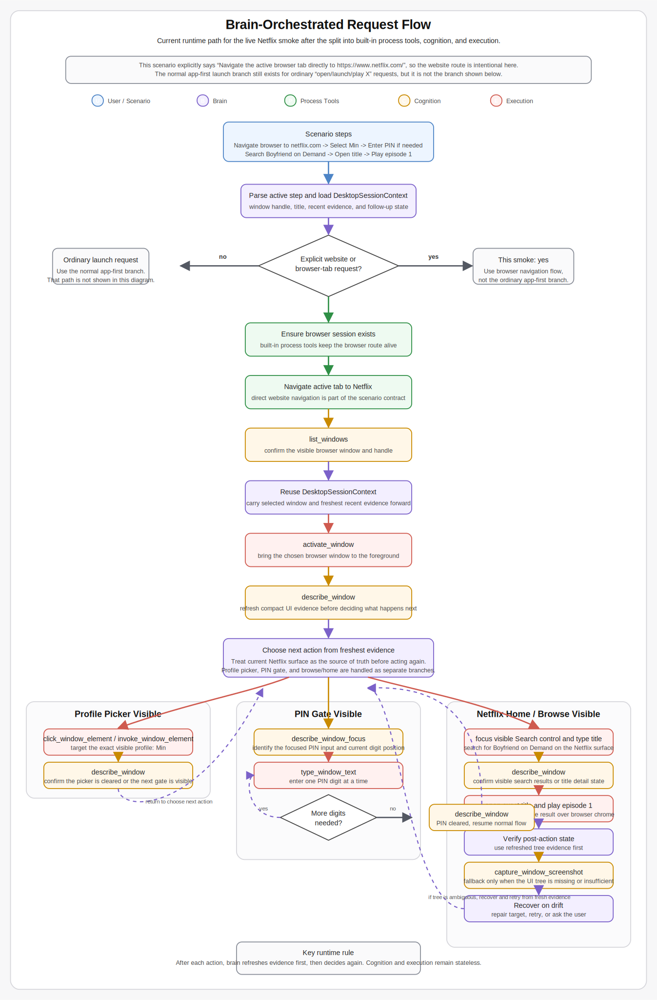

# Tools Refactor And Tool Naming Normalization

Last updated: 2026-04-19
Status: completed

## Summary

This design records the cutover from `src/herbody` to `src/tools` and the
replacement of the former `eyesandhands` MCP server with two MCP servers:
`cognition` and `execution`.

2026-04-26 update: the former separate `process-manager` package has since
been folded into `brain` as built-in process listing/start/stop tools.

The main goals are:

- rename `herbody` to `tools` in one pass,
- split observation and action into separate MCP servers,
- move desktop session ownership into `brain`,
- make the MCP layer stateless and explicit,
- normalize tool names to a strict `verb_object` format,
- split overloaded keyboard/text input into separate tools.

## Current Status

As of 2026-04-18, the structural cutover is complete for the main runtime path:

- `src/tools` is the active tree, and `brain` references `cognition` and
  `execution`.
- `DesktopSessionContext` is in place, and the main brain/test call paths are
  retargeted to the new tool and server names.
- `.github/agents`, repo docs, and code-facing references have been updated to
  use `cognition/...` and `execution/...`.
- The empty historical `src\herbody` directory has been removed, and lingering
  live test references to the old tool names have been retargeted.
- `dotnet build src\heronwin.sln` and `dotnet test src\heronwin.sln` both pass.
- Local untracked `brain/.env` MCP wiring now points at `cognition` and
  `execution` instead of the old `eyesandhands` executable.
- A new `brain` guardrail blocks `start_process` from hijacking
  browser-navigation requests into Microsoft Store or other OS-process launch
  paths.
- `brain` now keeps ordinary launch requests app-first: it prefers an installed
  app or matching app window and asks before falling back to a website when the
  app launch stayed unconfirmed for a likely web-backed app request.
- Post-action evidence now stays UIAutomation-first by default. Follow-up
  screenshots are captured mainly when the refreshed UI tree is unavailable or
  unchanged after an action that should have changed visible state.
- Exact named-target repair is tighter for noisy browser and Netflix surfaces:
  explicit names like `Min` now beat shared generic matches such as `Add
  Profile` or `Manage Profiles`, and visible Netflix site-search controls are
  preferred over browser chrome or `Open in app` distractions.
- Netflix PIN continuation now refreshes focus before auto-completing remaining
  digits, and the PIN-gate detector no longer confuses the `Manage Profile
  Lock` settings page with the real PIN-entry prompt.

The previous build failure was not caused by low disk space. It came from a
repo-local ACL issue on generated `obj` and `bin` folders, which has been
repaired. A reboot is still useful before the next pass because it can clear any
lingering file handles.

Remaining follow-up after the cutover:

- keep tightening the live Netflix smoke so it stays deterministic across real
  account-state branches such as stale tabs, profile-lock settings, and
  confirmation prompts. The opening step now explicitly navigates to
  `https://www.netflix.com/`, but the live site can still land on account
  surfaces that block the scripted picker/search/playback flow,
- keep the rename map below as the historical record of the migration.

## Decisions

### Repository and project structure

- `src/herbody` becomes `src/tools`.
- Process listing/start/stop behavior lives in `brain`.
- The current `eyesandhands` code is split into:
  - a shared Windows automation library,
  - a `cognition` MCP host,
  - an `execution` MCP host.
- Existing namespaces and project names move from `HeronWin.HerBody.*` to
  `HeronWin.Tools.*`.
- `micrecorder` moves under `src/tools` as a rename-only carry-forward item.

### Session ownership

- `brain` owns the current desktop session for the active conversation.
- MCP servers do not keep cross-call selected-window state.
- `brain` tracks:
  - current window handle,
  - current window title,
  - recent `list_windows` output,
  - recent UI tree evidence,
  - recent focus evidence.

### Tool contract rules

- All tool names use `verb_object`.
- All window-scoped tools take explicit `windowHandle`.
- Element-targeting tools take explicit `elementPath`, using the `uiPath`
  values returned by cognition tools.
- `launch_application` keeps the current taskbar-search launch strategy for now,
  but the route is not encoded in the tool name.
- For ordinary "open/launch/play X" requests, `brain` should try the app path
  before browser navigation. Website flow is the default only when the user
  explicitly asks for a website, URL, browser tab, or in-browser content.

## End-To-End Flow

### Brain-Orchestrated Request Flow

The following diagram shows the current end-to-end flow for the live smoke
scenario in `src/scenarios/netflix-boyfriend-on-demand.yml`.

This case intentionally starts with a browser-navigation command, so `brain`
does not use the normal app-first launch branch. The first step explicitly says
`Navigate the active browser tab directly to https://www.netflix.com/`, which
means the website route is part of the scenario contract rather than a fallback.



### Scenario Notes

- `brain` owns session continuity across the whole flow. `cognition` and
  `execution` stay stateless and only act on the explicit window handle and
  element path that `brain` supplies.
- The main control loop is evidence-driven: inspect current Netflix surface,
  choose one action, then refresh evidence before deciding again.
- The profile and PIN stages are treated as gating surfaces. `brain` must clear
  them before it is allowed to continue to search or playback.
- PIN entry is intentionally modeled as a per-digit loop using refreshed focus
  evidence, because the Netflix profile-lock screen is more reliable that way
  than a single bulk text send.
- For `Boyfriend on Demand`, `brain` should prefer an exact visible title match
  from Netflix search results over generic browser chrome, hero banners, or
  off-target site controls.
- Screenshot capture is a fallback evidence source, not the default success
  path. The preferred confirmation path is refreshed UIAutomation state from
  `describe_window` or `describe_window_focus`.

## Tool Naming

### Nouns

Use these nouns consistently:

- `window`
- `taskbar_items`
- `taskbar_app`
- `application`
- `window_element`
- `window_main_menu_items`
- `window_context_menu_items`

### Verbs

- cognition: `list`, `describe`, `capture`
- execution: `activate`, `focus`, `click`, `invoke`, `set`, `press`, `type`,
  `launch`

### Rename map

#### Cognition

- `list_windows` -> `list_windows`
- `list_taskbar_elements` -> `list_taskbar_items`
- `describe_selected_window` -> `describe_window`
- `capture_selected_window_screenshot` -> `capture_window_screenshot`
- `describe_selected_window_focus` -> `describe_window_focus`
- `list_main_menu_items` -> `list_window_main_menu_items`
- `list_context_menu_items` -> `list_window_context_menu_items`

#### Execution

- `select_window` -> `activate_window`
- `select_taskbar_app` -> `activate_taskbar_app`
- `launch_app_via_taskbar_search` -> `launch_application`
- `focus_selected_window_element` -> `focus_window_element`
- `click_selected_window_element` -> `click_window_element`
- `invoke_selected_window_element` -> `invoke_window_element`
- `set_selected_window_element_value` -> `set_window_element_text`
- `send_input_to_window` -> `press_window_key` and `type_window_text`
- `invoke_main_menu_item` -> `invoke_window_main_menu_item`
- `invoke_context_menu_item` -> `invoke_window_context_menu_item`

## Implementation Notes

### Brain

- Add a `DesktopSessionContext` for the active conversation.
- Inject `windowHandle` into cognition and execution calls when the action is
  clearly targeting the current window.
- Retarget existing tool rewrite logic, follow-up evidence collection, and
  confidence checks to the new tool names.
- Replace `eyesandhands`-specific MCP server detection with explicit handling
  for `cognition` and `execution`.
- When app launch cannot be confirmed and the request was not explicitly for the
  web, pause and ask before falling back to a website.
- Prefer fresh `describe_window` / `describe_window_focus` evidence after
  actions, and only escalate to `capture_window_screenshot` when the UI tree is
  missing the needed state change or is otherwise insufficient.

### Tools

- Split the current `eyesandhands` host into a shared automation library plus
  separate cognition and execution hosts.
- Keep taskbar discovery broad with `list_taskbar_items`.
- Keep taskbar execution app-specific with `activate_taskbar_app` and
  `launch_application`.
- Split the old mixed input tool into:
  - `press_window_key`
  - `type_window_text`

### Docs and prompts

- Update `.github/agents` prompts and skills from `eyesandhands/...` to
  `cognition/...` and `execution/...`.
- Update repository docs to describe `tools`, the server split, and
  `brain`-owned desktop session state.

## Verification

Verified on 2026-04-18:

```powershell
dotnet build src\heronwin.sln
dotnet test src\heronwin.sln
dotnet test src\head\brain.tests\HeronWin.Brain.Tests.csproj
```

- `dotnet build src\heronwin.sln` passed with 0 warnings and 0 errors.
- `dotnet test src\heronwin.sln` passed with 295 total tests.
- `dotnet test src\head\brain.tests\HeronWin.Brain.Tests.csproj` passed
  with 214 total tests.

Smoke-test status:

```powershell
.\buildandrun.ps1 -BrainOnly -Scenario src\scenarios\netflix-boyfriend-on-demand.yml
```

- The refactored MCP stack now connects successfully with `cognition` and
  `execution` exposed through `MCP_SERVERS`; process tools are built into
  `brain`.
- The stricter brain checks now correctly surface live Netflix problems instead
  of waving them through: exact profile selection is repaired more reliably,
  stale or repeated PIN entry no longer silently passes, and the `Manage
  Profile Lock` settings page is no longer treated as a valid PIN gate.
- The current website-based smoke is still not deterministic end to end because
  real Netflix account-state prompts can interrupt the scripted path before the
  search/playback steps. That remains a live-smoke follow-up, not a cutover
  compile/test blocker.

## Assumptions

- This is a full cutover with no long-lived `herbody` or `eyesandhands`
  compatibility aliases.
- `brain` session state is runtime-local and not persisted across restarts.
- `list_taskbar_items` remains broader than `activate_taskbar_app` by design.
- Splitting keyboard and text input is part of this refactor, not a follow-up.
