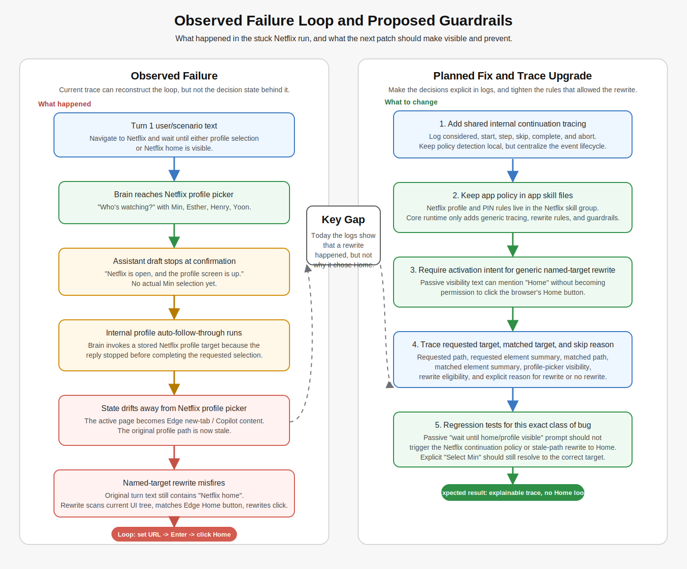

# Brain Debuggability and Rewrite Guardrails

Last updated: 2026-04-19
Status: completed

## Summary

This plan addresses the Netflix/Codex failure where `brain` saw the Netflix
profile picker, an internal follow-through path went stale, and a later
named-target rewrite reinterpreted the action as Edge browser chrome
(`Home`) because the original turn text mentioned "Netflix home".

It also uses that failure to define a more general tracing shape for
internal continuations, so future app-specific helpers can explain their
decision path with the same event vocabulary instead of each feature growing
its own special-case logs.

The goal is to improve two things together:

- debuggability, so future failures can be explained from the trace without
  manual log archaeology
- rewrite guardrails, so passive observation text does not become an
  actionable click target

## Implementation Status

Landed on 2026-04-19:

- `agent.named_target_rewrite_evaluated`
- the generic internal continuation lifecycle events plus preflight window and
  focus snapshot events
- activation-intent guardrails on generic named-target rewrites
- sensitive `type_window_text` argument redaction in debug previews
- follow-on generic continuation and discrete-slot migration under
  `docs/designs/generic-continuations-and-discrete-entry-plan.md`, which
  removed the old Netflix-specific continuation and PIN helper names from
  production runtime
- the broader app-boundary follow-through under
  `docs/designs/app-agnostic-runtime-and-skills-plan.md`, including boundary
  enforcement tests and generic chooser-surface cleanup, is now complete

## Visual Overview

## Problem Statement

Observed failure pattern from the aborted scenario run:

1. Turn 1 navigated Edge to `https://www.netflix.com/`.
2. The profile picker became visible.
3. The assistant draft stopped after confirming that the profile picker was
   on screen.
4. `brain` internally followed through and tried to activate the requested
   Netflix profile.
5. The active page changed away from the Netflix picker.
6. A later `click_window_element` targeting the old Netflix path was
   rewritten by `exact_named_visible_target_preferred`.
7. Because the original turn text said "either the Netflix profile selection
   screen or Netflix home is visible", the rewrite found `Home` in Edge
   chrome and clicked that instead.
8. The run looped between entering the Netflix URL and returning to the Edge
   home/new-tab surface.

The current logs were sufficient to reconstruct the sequence, but not the
decision state. The trace did not directly answer:

- why profile auto-follow-through triggered
- what the requested stale element was at rewrite time
- what named candidates were considered
- why `Home` won over "do not rewrite"

## Goals

- Make named-target rewrites explainable from a single structured trace event.
- Make internal continuation decisions explainable from explicit considered,
  start, step, skip, complete, and abort trace events.
- Prevent passive "wait until visible" language from turning into an action
  target rewrite.
- Prevent turns that merely mention "profile selection screen" from
  triggering profile-selection auto-follow-through.
- Add focused regression tests for the exact failure mode we saw.

## Non-Goals

- Redesign all action-rewrite logic in one pass.
- Remove the current Netflix continuation behaviors entirely.
- Change MCP snapshot formats or the compact-tree contract.
- Add always-on screenshot capture beyond the current debug-mode behavior.
- Add a Netflix-only tracing subsystem that future apps cannot reuse.

## Architecture Boundary

This patch should follow the repository rule in
`.github/agents/skill-vs-code-policy.md`:

- prompts and skills define app behavior
- runtime code enforces generic reliability

For this work, that means the code changes should stay app agnostic.

Runtime code should own:

- the generic continuation lifecycle and trace schema
- generic guardrails for stale-path rewrite eligibility
- generic evidence refresh, abort, and completion reporting
- regression tests for generic reliability rules

App-specific agent or skill files should own:

- app vocabulary such as profile picker, profile lock, search, browse, or
  playback language
- when an app-specific continuation is appropriate versus when the agent
  should stop and report state
- target-selection playbooks such as exact profile matching rules
- app-specific sequencing such as per-digit PIN entry preferences
- app-specific success criteria

For Netflix specifically, that policy should live in:

- `.github/agents/skills/netflix/netflix-profile-and-pin.skill.md`
- `.github/agents/skills/netflix/netflix-surface-and-state.skill.md`
- `src/scenarios/netflix-boyfriend-on-demand.yml` when scenario wording needs
  to make turn boundaries clearer

The existing Netflix-specific branches in `Conversation.cs` should be treated
as migration debt, not as the pattern to extend. This patch should avoid
adding new app-name-specific branching to core runtime code.

## Proposed Changes

## 1. Add Named-Target Rewrite Decision Tracing

Add a new JSONL event for action-tool rewrite evaluation:

- category: `agent.named_target_rewrite_evaluated`

Recommended fields:

- `turn`
- `toolCallId`
- `tool`
- `userTextPreview`
- `requestedPath`
- `requestedElementResolved`
- `requestedElementSummary`
  - `path`
  - `name`
  - `controlType`
  - `className`
  - `automationId`
  - `availableActions`
- `requiredAction`
- `userRequestedActivation`
- `snapshotContainsProfilePicker`
- `matchedPath`
- `matchedElementSummary`
- `rewritten`
- `skipReason`

Why this matters:

- the exact stale-path-to-Home failure would have been visible immediately
- we would know whether the requested element still existed at evaluation time
- we would know whether rewrite was skipped because the prompt lacked action
  intent, because no named match existed, or because the requested element was
  already specific enough

## 2. Add Internal Continuation Tracing

Treat Netflix profile follow-through as the first adopter of a general
internal continuation model: when `brain` decides to finish an obvious next
UI step on the user's behalf, it should emit the same lifecycle regardless of
which app-specific policy produced the candidate.

Add generic lifecycle events:

- `agent.internal_continuation_considered`
- `agent.internal_continuation_started`
- `agent.internal_continuation_step_completed`
- `agent.internal_continuation_completed`
- `agent.internal_continuation_skipped`
- `agent.internal_continuation_aborted`

Recommended fields:

- `turn`
- `continuationId`
- `policyName`
- `continuationKind`
- `triggerReason`
- `userTextPreview`
- `assistantReplyPreview`
- `userIntentSummary`
- `surfaceSummary`
- `targetSummary`
- `plannedSteps`
- `stepIndex`
- `stepAction`
- `stepTargetSummary`
- `result`
- `skipReason`
- `abortReason`
- `preActionWindow`
- `postActionWindow`

Implementation shape:

- shared continuation contract:
  runtime code defines a generic continuation lifecycle, trace payload shape,
  correlation ID, and completion or abort handling
- skill-owned app policy:
  app-specific skills define when the assistant should continue, what target
  it should choose, and what success looks like
- narrow runtime integration:
  if legacy app-specific continuations remain temporarily in code, they should
  emit the shared generic events and should not grow new app-specific trace
  formats or branching patterns

First adopters:

- `policyName = "netflix_named_choice_continuation"`
  - `continuationKind = "select_visible_named_choice"`
- `policyName = "netflix_discrete_slot_text_entry"`
  - `continuationKind = "enter_remaining_discrete_text"`

Why this matters:

- future traces will clearly show whether `brain` considered continuing on the
  user's behalf, whether it actually started, and where it stopped
- the same event family can cover browser prompts, modal confirmations, OTP
  entry, installer flows, and other small follow-through helpers later
- Netflix stays the immediate bug fix, but the added tracing becomes reusable
  infrastructure instead of a one-off patch

## 3. Tighten Generic Named-Target Rewrite Guardrails

Current issue:

- `TryRewriteGenericContainerActionToNamedTarget(...)` can reinterpret a stale
  action path by scanning the current UI tree for any named element mentioned
  in the turn text
- this is too permissive for passive prompts such as "wait until either the
  profile selection screen or Netflix home is visible"

Planned guardrail:

- only allow this generic named-target rewrite when the user text expresses
  activation intent

Examples that should allow rewrite:

- "Select Min."
- "Open Manage Profiles."
- "Click Search."

Examples that should not allow rewrite:

- "Wait until Netflix home is visible."
- "Confirm that the profile selection screen is open."
- "Tell me whether Home is visible."

Expected outcome:

- the stale Netflix profile path will not be rewritten into Edge `Home`
  during a passive visibility/navigation turn
- explicit corrective rewrites for real selection turns still work

## 4. Tighten Netflix Behavior in Netflix Skill Files

Current issue:

- the Netflix behavior should only treat profile selection as actionable when
  the user explicitly asked to select a profile
- turns that merely mention the phrase "profile selection screen" should stay
  observational and should not qualify as continuation intent
- that rule belongs in the Netflix skill files, not as new app-specific
  branching inside core runtime code

Planned guardrail:

- update the Netflix skill files so they explicitly separate:
  - passive visibility checks
  - explicit profile-selection turns
  - explicit PIN-entry turns
- make the Netflix skill wording state that passive observation text does not
  authorize profile activation
- keep exact profile matching, ASR repair guidance, and per-digit PIN rules in
  the Netflix skill group rather than encoding more of that behavior in
  generic runtime logic

Examples that should count:

- "Select the profile named Min."
- "Choose Min's profile."
- "Click the Min profile."

Examples that should not count:

- "Wait until the profile selection screen is visible."
- "Tell me whether the profile screen is showing."
- "Navigate to Netflix and stop when profile selection is visible."

Expected outcome:

- turn 1 of the scenario will stop at the correct wait condition
- turn 2 will own the actual profile-selection action
- the Netflix-specific behavior will be expressed where future Netflix fixes
  are expected to live

## 5. Add Focused Regression Tests

Add or update tests in `src/head/brain.tests/AgentRunnerDecisionTests.cs` for:

- passive visibility prompt does not trigger Netflix profile-target matching
- passive visibility prompt does not rewrite a stale click into `Home`
- explicit "Select Min" still resolves the correct profile target
- existing named-target rewrite behavior for explicit user intent still passes

If practical, also add a small trace-oriented test that validates the new
decision payload shape at the helper level.

## Planned Implementation Order

1. land named-target rewrite evaluation tracing
2. land internal continuation tracing with an app-agnostic event schema
3. tighten generic named-target rewrite guardrails
4. revise the Netflix skill files so passive checks, profile selection, and
   PIN entry are explicitly separated there
5. add focused regression tests
6. rerun the scripted Netflix scenario in debug mode
7. confirm the new trace makes the decision path obvious

## Risks and Mitigations

- Risk: rewrite guardrails become too strict and remove useful corrections
  - Mitigation: limit the new block to passive, non-activation prompts and
    keep the existing explicit-intent tests green

- Risk: profile-selection intent detection misses useful phrasing variants
  - Mitigation: start conservative, then expand from real traces rather than
    broad guesses

- Risk: trace volume gets noisy
  - Mitigation: keep the full detail in JSONL, use previews instead of full
    payload dumps, and reserve candidate-level expansion for follow-up if
    needed

- Risk: the generic continuation schema is too narrow for future app flows
  - Mitigation: start with policy name, continuation kind, target summary, and
    step summaries; extend from actual second-use cases rather than guessing

- Risk: the patch quietly adds more Netflix-specific logic to `Conversation.cs`
  - Mitigation: treat the skill files as the place for app policy and review
    every runtime change against the repository skill-versus-code checklist

## Review Questions

- Is "activation intent required" the right top-level rule for generic
  named-target rewrite, or do we want an even narrower rule?
- Is the proposed internal continuation schema generic enough for other apps,
  or are we missing one or two fields we will want immediately?
- Are the Netflix profile-selection and PIN rules better expressed as skill
  changes first, with runtime changes limited to generic tracing and
  guardrails?
- Do we want candidate lists in the new rewrite event now, or only requested
  and chosen element summaries in the first pass?
- Do we want a follow-up task to retire the current Netflix-specific
  continuations from `Conversation.cs` once the generic tracing and skill
  guidance are in place?

## Expected Outcome

If this plan is approved and implemented, the next time a similar issue
happens we should be able to answer all of the following directly from the
trace:

- what the model asked to click
- whether that target still existed
- whether rewrite was even eligible
- what rewrite chose instead
- why rewrite chose it
- whether `brain` decided to continue an app step internally
- which policy made that continuation eligible
- which target and steps the continuation intended to execute
