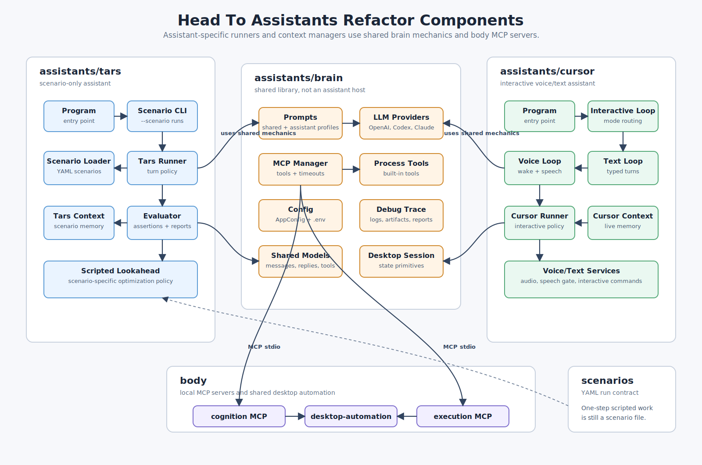

# Head To Assistants Refactor Plan

Last updated: 2026-05-03
Status: draft for review

## Summary

This plan covers the refactor of the current `src/head` tree into an
`src/assistants` tree and the split of the current `brain` executable into
assistant-oriented projects:

- `brain`: shared code used by assistant hosts
- `tars`: scenario-based assistant for running user scenarios
- `cursor`: voice/text interactive assistant

The goal is to make each assistant own its control loop and context policy,
while keeping provider, tool, prompt, and configuration plumbing shared.

## Opinion On The Latest Direction

I like the move to keep conversation runners and context management inside each
assistant. Those two areas are likely to diverge quickly:

- `tars` will care about deterministic scenario phases, assertions, trace
  evidence, and reproducibility.
- `cursor` will care about interactive continuity, interruption, voice/text
  ergonomics, and live user feedback.

Duplicating runner/context code at the assistant layer is acceptable here. It
keeps the assistant personalities and execution policies explicit, and we can
extract a shared abstraction later only after the duplication shows a stable
shape.

Dropping ad-hoc `--command` support is also a good simplification. If scenario
files are the contract, even a one-step run can be represented as a one-command
scenario. That gives every scripted run the same trace and assertion model.

## Current State

The current `src/head` tree contains:

```text
src/head/
  brain/        .NET 10 executable with shared runtime, scripted mode,
                text mode, voice mode, LLM clients, MCP client, process tools,
                debug tracing, and scenario testing helpers
  brain.tests/  xUnit tests for the current brain assembly
```

Important current couplings:

- `Brain.csproj` is an executable and owns both scripted and interactive entry
  points through `Program.cs`.
- Tests access internal runtime types through
  `InternalsVisibleTo("HeronWin.Brain.Tests")`.
- `buildandrun.ps1`, README files, get-started docs, and historical design docs
  reference `src/head/brain`.
- `DotEnvLoader` searches several legacy brain paths, including
  `src/head/brain/.env`.
- `Brain.csproj` references the `body/cognition` and `body/execution` projects
  with `ReferenceOutputAssembly="false"` so the MCP server binaries are built
  with the runtime.

## Desired Structure

```text
src/assistants/
  brain/
    Brain.csproj
    README.md

  tars/
    Tars.csproj
    Program.cs
    .env.example
    README.md

  cursor/
    Cursor.csproj
    Program.cs
    .env.example
    README.md

  brain.tests/
    HeronWin.Brain.Tests.csproj

  tars.tests/
    HeronWin.Tars.Tests.csproj

  cursor.tests/
    HeronWin.Cursor.Tests.csproj
```

The top-level solution folder should be renamed from `head` to `assistants`.
The physical folder should move from `src/head` to `src/assistants`.

## Component Diagram



## Current Code Cross-Check

The current code mostly supports this direction, but the implementation plan
needs these concrete adjustments:

- `src/heronwin.sln` still has an active retired UI project and solution
  folder. Deletion must remove the project entry, configuration entries, nested
  project entries, and the source directory.
- `buildandrun.ps1` currently builds and starts both the old assistant runtime
  and the retired UI. The launcher should be rewritten around `cursor` and
  `tars`, not only path-edited.
- `Brain.csproj` is currently an executable and carries build-order references
  to `body/cognition` and `body/execution`. After `brain` becomes a library,
  move those build-order references to runnable host projects unless a local
  build proves transitive references are enough.
- `Brain.csproj` currently carries `NAudio` because audio code lives in
  `brain`. When `Audio.cs` moves to `cursor`, move the `NAudio` package
  reference to `Cursor.csproj`.
- `AppConfig` currently contains named-pipe status settings for the retired UI.
  Remove those config fields, environment variables, defaults, tests, and
  startup logging fields.
- `Program.cs` is a top-level program with many local functions. Before or
  during the split, extract those local functions into host-owned classes so
  `tars/Program.cs` and `cursor/Program.cs` stay thin.
- `Conversation.cs` is a mixed file: shared models, `AgentRunner`, `Display`,
  and `ContextManager` live together. Treat it as a carve-out task:
  - keep shared message/reply/tool models in `brain`
  - duplicate runner logic into `tars` and `cursor`
  - duplicate or move context management into `tars` and `cursor`
  - split display responsibilities so shared `brain` has reusable console and
    trace helpers, while assistant-specific UX decisions stay in the assistants
- `TurnProcessor.cs` is coupled to `AgentRunner`, `ContextManager`, `Display`,
  app skill generation, and status publishing. It should become assistant-owned
  orchestration, not stay in shared `brain` unchanged.
- `ConsoleMode.cs` currently supports ad-hoc command input, command files,
  scenarios, and trace reporting. `tars` should remove command and command-file
  run input. Trace reporting should move to shared `brain` diagnostics and be
  exposed by every assistant CLI.
- `YamlConfiguration.cs` includes `BrainCommandFileLoader`, which becomes dead
  code when command files are removed. Keep the YAML parser and scenario loader;
  delete the command-file loader.
- `BrainTraceReporter` is actively tested and documented. Keep it in shared
  `brain` as assistant-agnostic trace diagnostics, with tests that cover logs
  emitted by multiple assistant categories.
- Existing tests are concentrated under `brain.tests` and directly exercise
  `AgentRunner`, `ContextManager`, scenario parsing, command-file parsing, and
  trace reporting. The test split should move or duplicate tests according to
  final ownership rather than leaving runner tests in `brain.tests`.
- `AgentPromptLoader` resolves `.github/agents` from the current working
  directory. That should keep working for repo-root launches, but host READMEs
  should tell users to run from the repo root or set explicit prompt paths.
- The current prompt loader assumes one default agent definition and one core
  prompt. That is too narrow for assistant-specific operating models. The split
  should add assistant-aware prompt catalog loading instead of only swapping
  `AGENT_DEFINITION_PATH`.

## Project Roles

### brain

`brain` becomes a shared library rather than a launched assistant. It should
hold the runtime pieces both `tars` and `cursor` need:

- agent prompt loading and composition
- shared prompt, message, reply, tool-call, and trace models
- LLM provider catalog and client implementations
- MCP client manager and built-in process tools
- app skill generation primitives
- debug tracing and artifact cleanup
- trace report generation and shared trace diagnostics
- shared config parsing and `.env` loading infrastructure
- desktop session primitives that assistants can use or wrap
- low-level YAML parsing utilities if they are needed by shared prompt/config
  code

`brain` should not own assistant-specific conversation runners or context
management after the split. Keep the namespace as `HeronWin.Brain` during the
structural pass to reduce churn. A later cleanup can rename namespaces to
`HeronWin.Assistants.Brain` if we want the source names to fully match the new
folder names.

### display

`Display` currently does three jobs in one static class:

- writes user-facing console output, such as banners, info/warn/error lines,
  prompts, transcripts, assistant replies, tool calls, tool results, and
  context usage
- writes `display.*` debug trace events for that console output
- maps some display events to the retired status bridge

After the split, it should not remain as-is inside shared `brain`.

Recommended target:

- keep a small shared console formatting helper in `brain` only if both
  assistants use the same labels and formatting
- remove retired status publishing from display code
- let `tars` own scenario-run presentation, including scenario headers, turn
  pass/fail output, assertion summaries, and report links
- let `cursor` own interactive presentation, including prompts, wake/listening
  messages, transcripts, spoken replies, and mode-switch output
- keep display-to-trace calls lightweight and common, but do not make console
  output the only way an assistant records important diagnostic events

The important boundary is that display is user presentation. Trace events are
diagnostics. They can happen together, but assistants should be able to record
diagnostics even when there is no console line to show.

### trace diagnostics

`DebugTrace`, artifact cleanup, trace file naming, redaction helpers, and trace
report generation should remain in `brain`.

Each assistant owns when and what to record:

- `tars` records scenario start/end, scenario file path, assertion inputs,
  assertion results, scenario turn boundaries, lookahead decisions, and
  reproducibility metadata.
- `cursor` records interactive mode changes, wake/listening transitions,
  transcript boundaries, cancellation or reset events, and voice/text service
  failures.
- shared provider/tool code records LLM requests/responses, MCP calls,
  redacted tool arguments, tool results, retry/throttle events, and shared
  artifact paths.

Every assistant CLI should expose:

```powershell
dotnet run --project src/assistants/<assistant> -- --trace-report .\logs\<trace>.jsonl
```

This diagnostic command should be implemented once in `brain` and called from
assistant CLIs so future assistants get it by default.

### assistant prompts

Each assistant should have a dedicated main agent prompt. `tars` and `cursor`
have different operating models, so their system prompts should say different
things at the top level instead of relying only on runtime code differences.

Recommended prompt layout:

```text
.github/agents/
  shared/
    heronwin.core.md
    skills/
      any-app/
      edge/
      generic-app/
      netflix/

  tars/
    tars.agent.md
    tars.agent.core.md
    skills/
      scenario/

  cursor/
    cursor.agent.md
    cursor.agent.core.md
    skills/
      interactive/
```

Composition order:

1. shared `heronwin.core.md`
2. assistant main/core prompt
3. shared skills selected by activation
4. assistant-specific skills selected by activation
5. generated app skills, if still supported

`brain` should own the prompt loading and composition mechanics, but each
assistant should select its assistant id when loading prompts.

App/site skills should stay shared and assistant-agnostic. A Netflix, Edge,
Explorer, Spotify, or generic app skill should describe the application
surface, tool preferences, verification rules, and app-specific pitfalls
without caring whether the run came from `tars` or `cursor`.

Assistant-specific skills should be about operating mode, not apps:

- `tars` skills: scenario assertions, deterministic scenario phases,
  reproducibility, scripted lookahead, and run reporting
- `cursor` skills: interactive clarification, voice/text ergonomics, reset or
  interruption handling, and spoken response pacing

If an app skill starts saying "in scenario mode" or "in voice mode", that is a
signal to move that guidance into the assistant-specific prompt/skill layer and
keep the app skill reusable.

Suggested assistant prompt responsibilities:

- `tars.agent.md`: scenario-first behavior, deterministic execution, traceable
  evidence, assertion awareness, no ad-hoc command interpretation, and concise
  run reporting.
- `cursor.agent.md`: interactive voice/text behavior, spoken-friendly replies,
  interruption/reset expectations, mode switching, and live user collaboration.
- shared `heronwin.core.md`: tool contracts, evidence rules, UI automation
  invariants, response JSON shape, retry boundaries, and skill semantics.

Implementation notes:

- Replace or extend `AgentPromptLoader.Load()` with an assistant-aware API such
  as `Load(AssistantPromptProfile profile)` or `Load(string assistantId)`.
- Keep environment overrides, but make them assistant-specific:
  `TARS_AGENT_DEFINITION_PATH`, `CURSOR_AGENT_DEFINITION_PATH`, and optional
  shared fallback `AGENT_DEFINITION_PATH`.
- Log the resolved shared prompt path, assistant prompt path, active skill
  roots, and selected assistant id in `session.start`.
- Keep tests in `brain.tests` for prompt composition order, assistant-specific
  override resolution, shared skill loading, assistant skill loading, and
  generated skill persistence.

### tars

`tars` owns scenario execution. Runtime input supports only scenario files:

- `--scenario`

It should not support:

- `--command`
- repeated `--command`
- `--commands-file`

One-step scripted work should be represented as a one-command scenario. This
keeps all non-interactive runs on the same scenario, trace, and assertion
contract.

`tars` should support `--trace-report` through the shared `brain` diagnostic
command. That command does not execute user work and can be preserved without
bringing back ad-hoc command input.

`tars` owns:

- scenario CLI parsing and help text
- scenario loading and validation
- scenario turn loop
- scenario-specific conversation runner
- scenario-specific context manager
- log-based assertions and scenario result reporting
- trace report generation, if preserved
- scripted lookahead policy if it remains scenario-only
- the selected `tars` prompt profile and scenario operating-mode skills

Recommended first command shape:

```powershell
dotnet run --project src/assistants/tars -- --scenario src/scenarios/netflix-boyfriend-on-demand.yml
```

### cursor

`cursor` owns interactive voice/text assistance:

- provider-selected default interactive mode
- text input loop
- voice input loop
- shared `--trace-report` diagnostic command
- wake word handling
- transcription and speech playback
- `/reset`, `/exit`, `/mode:voice`, and `/mode:text`
- interactive conversation runner
- interactive context manager
- the selected `cursor` prompt profile and interactive operating-mode skills

Recommended first command shape:

```powershell
dotnet run --project src/assistants/cursor
```

## Proposed File Ownership

Initial split:

| Current file group | New owner |
| --- | --- |
| `Program.cs` scripted branch | `tars/Program.cs` |
| `Program.cs` text/voice loop | `cursor/Program.cs` |
| `ConsoleMode.cs` | `tars`, renamed around scenario-only CLI |
| `ScenarioTesting.cs` | `tars` |
| `ScriptedLookahead.cs` | `tars` unless cursor needs the same policy later |
| `Audio.cs`, `SpeechGate.cs`, `VoiceLanguagePreferences.cs` | `cursor` |
| `InteractiveModeCommands.cs` | `cursor` |
| current retired UI project | delete from the repo |
| current named-pipe status bridge | delete unless a replacement status sink is added later |
| `Display` console/status rendering | split into shared console helpers plus assistant-owned presentation, with retired status publishing removed |
| `Conversation.cs` runner logic | duplicate into `tars` and `cursor`, then trim per assistant |
| `ContextManager` logic | duplicate into `tars` and `cursor`, then trim per assistant |
| shared conversation models from `Conversation.cs` | `brain` |
| `TurnProcessor.cs` orchestration | duplicate into `tars` and `cursor`, then trim per assistant |
| `AppConfig.cs`, `Llm*`, `OpenAiCodexCliClient.cs` | `brain` |
| `McpClientManager.cs`, `BuiltInProcessTools.cs` | `brain` |
| `AgentPrompts.cs`, `AppSkillGeneration.cs`, shared `YamlConfiguration.cs` pieces | `brain` |
| `DebugTrace.cs`, `ArtifactCleanup.cs`, `HttpClientFactory.cs` | `brain` |
| `DisplayTopology.cs`, `DesktopSessionContext.cs` | `brain` |
| `BrainCommandFileLoader` | delete |
| `BrainTraceReporter` | `brain`, exposed through every assistant CLI |
| assistant main/core prompt files | `.github/agents/tars` and `.github/agents/cursor` |
| shared prompt and app/site skills | `.github/agents/shared` |
| assistant operating-mode skills | `.github/agents/tars/skills` and `.github/agents/cursor/skills` |

The key rule: assistant policy stays in assistant projects, shared mechanics
stay in `brain`.

## Environment File Plan

Use assistant-specific `.env.example` files:

- `src/assistants/tars/.env.example`
- `src/assistants/cursor/.env.example`

`tars` and `cursor` should each call the shared `.env` loader with an assistant
kind or default project path. Search order should be:

1. current directory `.env`
2. the launched assistant folder `.env`
3. `src/assistants/.env`
4. legacy `src/head/brain/.env` fallback for migration

`BRAIN_ENV_DIR` should either be renamed to a neutral name such as
`HERONWIN_ENV_DIR` or kept temporarily with a compatibility alias. If renamed,
the loader should set both variables during the migration so relative MCP paths
continue to resolve.

## Solution And Build Updates

Update `src/heronwin.sln`:

- rename solution folder `head` to `assistants`
- remove the current retired UI project from the solution and delete its
  project directory from the repo
- point moved `HeronWin.Brain.Tests` project at `assistants\brain.tests`
- change `Brain.csproj` to a library
- add `Tars.csproj` and `Cursor.csproj`
- add `HeronWin.Tars.Tests.csproj` and `HeronWin.Cursor.Tests.csproj` if tests
  are split during the same pass

Build references:

- `tars` references `brain`
- `cursor` references `brain`
- `tars` and `cursor` keep build-order-only references to `body/cognition` and
  `body/execution` if their runs need those binaries built
- `cursor` owns the `NAudio` package reference after audio code moves out of
  `brain`
- every assistant CLI references shared `brain` diagnostics for `--trace-report`
- every assistant passes its assistant id/profile into shared prompt loading

## Launcher Updates

Update `buildandrun.ps1` around the new assistant names:

- default launch: run `cursor`
- `-CursorOnly`: run only the interactive assistant
- `-TarsOnly`: run only the scenario assistant
- `-Scenario`: route to `tars`
- `-TarsArgs`: pass extra args to `tars`
- `-CursorArgs`: pass extra args to `cursor`

Remove old UI launch behavior entirely. Keep `-BrainOnly` and `-BrainArgs` as
temporary compatibility aliases with a warning only if compatibility matters
for existing local workflows. If kept, `-BrainOnly -Scenario` should route to
`tars`; plain `-BrainOnly` should route to `cursor`.

## Documentation Updates

Documentation updates are part of the refactor, not a follow-up. The code
change is not complete until the current user-facing docs describe
`src/assistants`, `tars`, `cursor`, and the deleted retired UI project.

### Live Docs To Update

Must update:

- `README.md`
- `docs/GET_STARTED.md`
- `docs/get-started-script-mode.md`
- `docs/get-started-voice-mode.md`
- `docs/get-started-openaiconfig.md`
- `docs/GOAL_AND_DESIGN.md`
- `docs/README.md`
- `src/body/README.md`
- `src/assistants/brain/README.md`
- `src/assistants/tars/README.md`
- `src/assistants/cursor/README.md`

Expected content changes:

- replace active `src/head/...` paths with `src/assistants/...`
- replace script-mode commands from `brain --command` / `brain
  --commands-file` to `tars --scenario`
- document that one-step scripted work should be represented as a one-step
  scenario file
- replace interactive launch docs with `cursor`
- remove retired UI startup/settings instructions
- document `brain` as a shared library, not a runnable assistant
- document `--trace-report` as a shared diagnostic command available from every
  assistant
- document assistant-specific prompt files and shared prompt/skill layout
- update launcher examples from `-BrainOnly` to `-CursorOnly` and `-TarsOnly`
- update `.env` examples and path guidance for `tars`, `cursor`, and optional
  shared `src/assistants/.env`

### New Or Moved READMEs

Create or update:

- `src/assistants/brain/README.md`: shared library responsibilities and
  non-goals
- `src/assistants/tars/README.md`: scenario file contract, CLI, trace output,
  and assertion behavior
- `src/assistants/cursor/README.md`: interactive voice/text flow, provider
  defaults, and local commands

Remove or move:

- `src/head/brain/README.md` after the folder move
- the current retired UI project README, because that project is deleted from
  the repo

### Historical Docs Policy

Historical docs under `docs/designs`, `docs/bugs`, `docs/perfbase`, and daily
summaries can keep old paths where they describe old runs. Add a short note in
the docs index explaining that historical docs may reference `src/head/brain`
from before the refactor.

Historical docs should only be edited when they are linked from live setup
instructions or when their current wording claims to describe the active
architecture.

### Documentation Verification

After implementation, run stale-reference searches and review each hit:

```powershell
rg -n "src[/\\]head|head[/\\]brain|dotnet run --project src[/\\]head|BrainOnly|--command|--commands-file|brain \.env|retired UI|settings window" README.md docs src/body src/assistants buildandrun.ps1
```

Expected result:

- no stale references in live setup docs, READMEs, launcher docs, or active
  source comments
- allowed stale references only in historical docs that explicitly describe
  pre-refactor behavior
- any allowed stale reference should be clear from nearby context

## Test Plan

### Brain Regression Coverage

`brain.tests` should protect the shared mechanics that every assistant depends
on. It cannot prove every assistant-specific runner policy, but it can prevent
one assistant refactor from breaking the common substrate.

Keep or add shared tests for:

- prompt loading/composition and skill activation
- assistant-specific prompt profile resolution and composition order
- `.env` loading, relative MCP path resolution, provider selection, and config
  validation
- LLM provider contracts, response parsing, redaction, retry behavior, and
  model profile limits
- MCP manager tool listing, tool-call timeout behavior, image optimization,
  built-in process tools, and desktop-automation debug environment variables
- shared message/reply/tool models and assistant response parsing
- debug trace file naming, event envelope schema, sequence ordering, redaction,
  artifact paths, and trace report generation
- trace report parsing for categories emitted by both `tars` and `cursor`
- shared YAML parser behavior, while scenario-specific interpretation moves to
  `tars`

Add a small shared test fixture package or test helper namespace in
`brain.tests` for fake LLM clients, fake MCP managers, and trace assertions.
Assistant test projects can copy or reference equivalent helpers, but shared
helpers should not pull assistant projects back into `brain`.

Coverage boundary:

- `brain.tests` covers shared invariants and diagnostic format compatibility.
- `tars.tests` covers scenario runner policy, scenario assertions, lookahead,
  and scenario context behavior.
- `cursor.tests` covers interactive mode switching, voice/text loop decisions,
  wake/reset/exit behavior, and cursor context behavior.

To prevent cross-assistant regressions, each assistant should have adapter tests
that call shared `brain` APIs through that assistant's real wiring. Those tests
belong in the assistant test projects, while pure shared behavior remains in
`brain.tests`.

After each phase:

```powershell
dotnet build src/heronwin.sln
dotnet test src/heronwin.sln
```

Focused checks after the split:

```powershell
dotnet test src/assistants/brain.tests/HeronWin.Brain.Tests.csproj
dotnet test src/assistants/tars.tests/HeronWin.Tars.Tests.csproj
dotnet test src/assistants/cursor.tests/HeronWin.Cursor.Tests.csproj
dotnet run --project src/assistants/tars -- --help
dotnet run --project src/assistants/cursor -- --help
dotnet run --project src/assistants/tars -- --trace-report .\logs\<trace>.jsonl
dotnet run --project src/assistants/cursor -- --trace-report .\logs\<trace>.jsonl
```

Behavior smoke checks:

```powershell
dotnet run --project src/assistants/tars -- --scenario src/scenarios/netflix-boyfriend-on-demand.yml
.\buildandrun.ps1 -CursorOnly
.\buildandrun.ps1 -TarsOnly -Scenario src\scenarios\netflix-boyfriend-on-demand.yml
```

## Migration Phases

### Phase 1: Rename The Container And Delete Retired UI Project

- Move `src/head` to `src/assistants`.
- Delete the current retired UI project directory from the repo.
- Remove that project from the solution.
- Update solution paths and solution folder names.
- Update `buildandrun.ps1` paths without splitting behavior yet.
- Update `.env` discovery to include `src/assistants/brain/.env` and keep
  legacy `src/head/brain/.env` fallback.
- Update live docs from `src/head` to `src/assistants`.
- Verify build and tests.

### Phase 2: Create Brain Library And Thin Hosts

- Change `Brain.csproj` from executable to library.
- Add `Tars.csproj` and `Cursor.csproj`.
- Move current scripted/scenario entry flow into `tars/Program.cs`.
- Move current text/voice entry flow into `cursor/Program.cs`.
- Remove `--command` and `--commands-file`; keep only `--scenario` for `tars`.
- Wire `--trace-report` in both `tars` and `cursor` through shared `brain`
  diagnostics.
- Add assistant-specific prompt profiles and wire `tars` / `cursor` to select
  their own main agent files.
- Expose the smallest practical public/friend API from `brain` for the hosts.
- Keep namespaces stable unless a compile boundary requires a small rename.
- Verify build, tests, `tars --help`, and `cursor --help`.

### Phase 3: Move Assistant-Specific Runners

- Duplicate the current conversation runner into `tars` and `cursor`.
- Move or duplicate context management into `tars` and `cursor`.
- Move scenario-only logic to `tars`.
- Move voice/text-only logic to `cursor`.
- Split console display code into shared formatting helpers and assistant-owned
  presentation, removing old status publishing calls.
- Keep shared models, providers, tools, prompt loading, debug tracing, and
  config loading in `brain`.
- Move prompt content into shared and assistant-specific prompt files.
- Split tests by ownership where useful.
- Verify full solution tests.

### Phase 4: Polish Names And Compatibility

- Rename user-facing text from `brain` to `tars`, `cursor`, or shared `brain`
  depending on context.
- Decide whether to keep temporary compatibility aliases for old commands.
- Decide whether to rename namespaces from `HeronWin.Brain` to
  `HeronWin.Assistants.Brain`.
- Remove or deprecate legacy path fallbacks after at least one stable pass.

## Risks And Mitigations

- Duplicating runner/context code can drift. Mitigate by allowing drift where
  it reflects real assistant policy, and keep shared mechanics in `brain`.
- Large `Program.cs` split could hide behavior changes. Mitigate by first
  creating thin host programs and preserving the current control flow.
- Internal type access will break after the executable becomes a library.
  Mitigate with a small public host API or temporary `InternalsVisibleTo` for
  `Tars`, `Cursor`, and split test assemblies.
- `.env` lookup can silently pick the wrong file. Mitigate by logging the env
  file path in session startup and keeping legacy fallback during migration.
- Historical docs contain many old `src/head/brain` references. Mitigate by
  updating live docs only and documenting that historical records keep old
  paths.

## Open Questions

- Is `tars` the intended final name for the scenario assistant, replacing the
  earlier `auto` name?
- Should `brain` remain the namespace `HeronWin.Brain` for now, or should the
  implementation pass also rename it to `HeronWin.Assistants.Brain`?
- Should `tars` and `cursor` each have separate `.env` files, or should they
  share `src/assistants/.env` by default?
- Should trace files continue to be named `brain.debug.*`, or should they move
  to `tars.debug.*` and `cursor.debug.*`?
